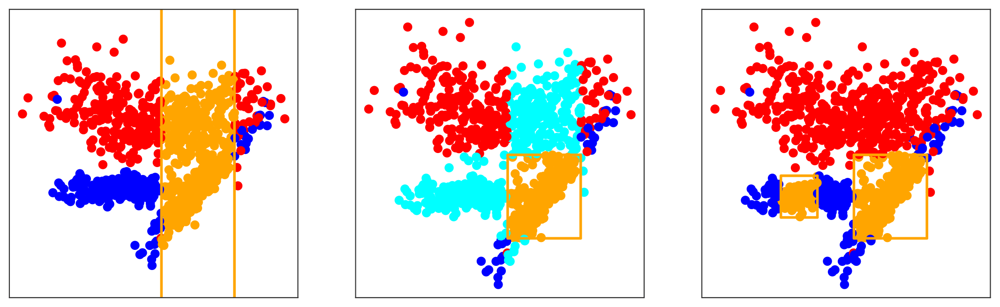
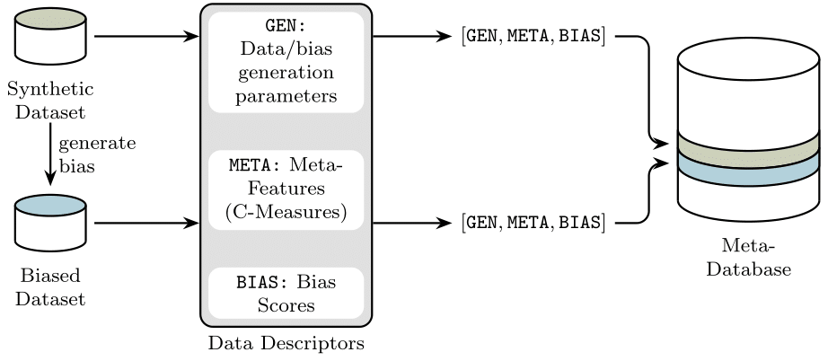

>📋  A template README.md for code accompanying a Machine Learning paper

# Meta-Learning to identify and quantify the risk of unseen discriminatory bias in classification datasets

This repository is the official repository of [Meta-Learning to identify and quantify the risk of unseen discriminatory bias in classification datasets](). It contains notebooks responsible for conducting experiments in this paper, and artifacts developed in our research.

Currently, research in making sure machine learning models free of discriminating predictions have been focusing on well-known bias. Few research have been conducted to ensure models are free of unforseen bias as well. In respsonse, we developed a new framework called Sensitive SSR (Subspace, Shape, Rule) to provide a more complex representation of marginalised populations on conitnous datasets. The sensitive SSR use the hireachy of Sensitive Rule, Sensitive Shape and Sensitive Subspace (illustracted respectively in the following graph) to describe marginalised populations in different levels.



We then investigate the effectiveness of using meta-learning techniques to predict discriminatory bias marked by Sensitive SSR frameworks. We rely on synthesised datasets and generated sensitive subspaces to conduct our experiments. The following graph depicts how we generate our meta-dataset, which is used in all of our experiments.



>📋  Optional: include a graphic explaining your approach/main result, bibtex entry, link to demos, blog posts and tutorials

## Requirements

To install necessary packages to redo our experiments:

```setup
pip install -r requirements.txt
```

>📋  Describe how to set up the environment, e.g. pip/conda/docker commands, download datasets, etc...

## Notebooks

After installing packages, you can rerun jupyter notebooks in root directory to better understand how we evaluate meta-learning models on our meta-datasets and solving our research questions.

Each notebooks correspound to different research questions:
- `Methodology_SSR_Framework_and_Meta_Dataset.ipynb` is responsible for demonstrating our artifacts such as sensitive SSR framework, the algorithms for synthesising sensitive subspaces and the meta-dataset.
    - For more details regarding our artifact, you can visit `artifact` folders and look through its codes.
- `Q1_binary_classification.ipynb` is responsible for research question ***Q1 Do meta-features capture information regarding bias?***, where we evaluate machine learning models' effectiveness on predicting whether datasets have high level of bias based on their metafeature.
- `Q2_regression.ipynb` is responsible for research question ***Q2 Can meta-features be used to quantify bias?***, where we evaluate machine learning models' effectiveness on predicting the value of dataset-level bias metrics based on datasets' metafeature.
    - `Q2b_stratified_regression.ipynb` is another experiment for research question ***Q2*** that is not included in our paper due to length, where we evaluate the effectivenss of machine learning models in predicitng the value of dataset-level bias metrics if stratified sampling is applied.
- `Q3_individual_chain.ipynb` is responsible for research question ***Q3 Can interactions between bias types help enhance predictive performance?***, where we apply Regressor Chain technqius to exploit correlation between dataset-level bias metrics.
- `Q4_config_settings.ipynb` is responsible for research question ***Q4 Which dataset characteristics or meta-features are particularly relevant to quantify bias?***, where we invesitgate the relationship between dataset generation parameters and bias metrics as well as models' performance.
- `Q5_case_study.ipynb` is responsible for research question ***Q5 Can our meta-features confirm expert-identified bias in well-researched datasets?***, where we conduct case studies with dataset of well-known and well-researched bias.
    - The artifacts that created during the process in stored in `case_study_artifact` folders.

Experiment results from all notebooks are stored in the `experiment_result` folders. All the figures used in our paper and this README.md are created and stored in the `plots` folders. They are all classified and organised based on which research question (or Methodology) they ar relevant to.  

<!-- ## Training

To train the model(s) in the paper, run this command:

```train
python train.py --input-data <path_to_data> --alpha 10 --beta 20
```

>📋  Describe how to train the models, with example commands on how to train the models in your paper, including the full training procedure and appropriate hyperparameters.

## Evaluation

To evaluate my model on ImageNet, run:

```eval
python eval.py --model-file mymodel.pth --benchmark imagenet
```

>📋  Describe how to evaluate the trained models on benchmarks reported in the paper, give commands that produce the results (section below).

## Pre-trained Models

You can download pretrained models here:

- [My awesome model](https://drive.google.com/mymodel.pth) trained on ImageNet using parameters x,y,z. 

>📋  Give a link to where/how the pretrained models can be downloaded and how they were trained (if applicable).  Alternatively you can have an additional column in your results table with a link to the models.

## Results

Our model achieves the following performance on :

### [Image Classification on ImageNet](https://paperswithcode.com/sota/image-classification-on-imagenet)

| Model name         | Top 1 Accuracy  | Top 5 Accuracy |
| ------------------ |---------------- | -------------- |
| My awesome model   |     85%         |      95%       |

>📋  Include a table of results from your paper, and link back to the leaderboard for clarity and context. If your main result is a figure, include that figure and link to the command or notebook to reproduce it.  -->


## Contributing

>📋  Pick a licence and describe how to contribute to your code repository. 
